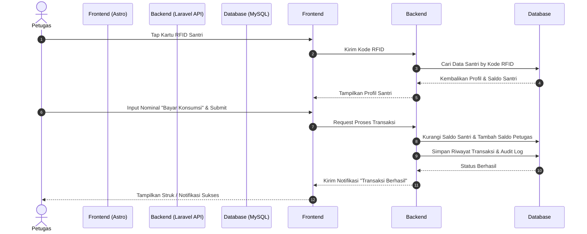
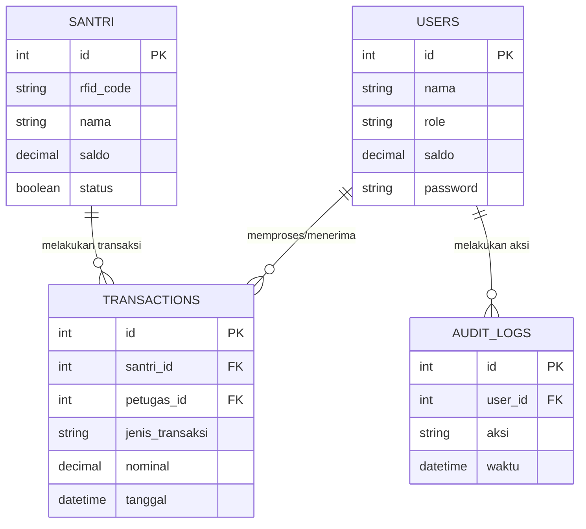

# PRD — Project Requirements Document

## 1. Overview

Pengelolaan uang saku santri di pondok pesantren seringkali masih manual, rentan hilang, dan sulit dilacak. Aplikasi Bank Pesantren ini hadir sebagai solusi dompet digital internal (sistem tertutup) untuk mengatasi masalah tersebut.

Tujuan utama dari aplikasi ini adalah mendigitalkan uang saku santri agar lebih aman dan transparan. Transaksi dijamin cepat menggunakan sistem pemindaian Kartu RFID, di mana **Admin** bertugas sebagai pemegang kas utama dan pengelola data, sementara **Petugas** (seperti kasir kantin atau pengurus asrama) bertugas memproses transaksi santri dan menerima perpindahan dana ke akun tugas mereka. Semua aktivitas akan dicatat secara detail untuk kebutuhan pelaporan dan audit.

## 2. Requirements

- **Platform:** Aplikasi berbasis web yang dioptimalkan untuk tampilan mobile (Mobile-First Web App / PWA) agar mudah diakses oleh Petugas melalui HP/Tablet.
- **Peran Pengguna (Role):**
    - **Admin:** Memiliki akses penuh, mengelola data santri, petugas, mengatur kas utama, dan melihat semua laporan.
    - **Petugas:** Hanya dapat memproses transaksi (menerima pemindahan dana, setor/tarik) dan melihat riwayat transaksinya sendiri.
    - **Santri:** Sebagai subjek transaksi (memiliki saldo, kartu RFID, dan riwayat namun tidak login ke sistem secara mandiri).
- **Integrasi Perangkat Keras:** Sistem harus mendukung input dari alat pembaca kartu RFID (RFID Reader) yang dihubungkan ke perangkat Petugas.
- **Sistem Tertutup:** Hanya melayani perputaran uang di dalam lingkungan pesantren (tidak ada integrasi dengan bank nasional/luar).

## 3. Core Features

- **Manajemen Data & Saldo:** Admin dapat menambah/mengedit data Santri dan Petugas, serta mengelola saldo awal dan mutasi kas pesantren.
- **Sistem Transaksi Multi-Jenis:**
    - _Setor Tunai & Tarik Tunai:_ Santri menabung atau mengambil uang saku fisik melalui Petugas.
    - _Bayar Konsumsi:_ Santri membayar makanan di kantin/koperasi (saldo santri berkurang, saldo akun Petugas bertambah).
    - _Transfer Antar:_ Pemindahan saldo antar santri.
    - _Donasi Infaq:_ Pemotongan saldo santri untuk disalurkan ke kas infaq pesantren.
- **Tap RFID (Identifikasi Cepat):** Petugas cukup menempelkan kartu RFID santri ke alat pembaca, dan profil serta saldo santri akan otomatis muncul di layar aplikasi.
- **Pusat Pelaporan & Audit Log:** Fitur untuk menghasilkan Laporan Harian, Rekap Bulanan, Laporan Mutasi per Santri, serta Log Audit (merekam siapa melakukan apa dan kapan).
- **Notifikasi In-App:** Pemberitahuan langsung di dalam aplikasi saat transaksi berhasil atau gagal.

## 4. User Flow

Berikut adalah perjalanan sederhana saat seorang Santri membeli makanan (Bayar Konsumsi) melalui Petugas:

1. **Login:** Petugas login ke dalam aplikasi mobile (web app).
2. **Scan RFID:** Santri menempelkan Kartu RFID ke alat pembaca yang terhubung ke perangkat Petugas.
3. **Verifikasi:** Layar aplikasi Petugas otomatis menampilkan foto, nama, dan sisa saldo Santri.
4. **Input Transaksi:** Petugas memilih menu "Bayar Konsumsi" dan memasukkan nominal harga makanan.
5. **Pemrosesan:** Aplikasi memvalidasi apakah saldo santri cukup. Jika cukup, saldo Santri dikurangi dan saldo akun Petugas ditambahkan.
6. **Selesai:** Muncul notifikasi "Transaksi Berhasil" di layar. Riwayat otomatis tercatat di sistem (Laporan dan Audit Log).

## 5. Architecture

Aplikasi ini menggunakan arsitektur _Client-Server_. Antarmuka pengguna (Frontend) akan berjalan di browser atau HP pengguna, yang kemudian akan berkomunikasi dengan peladen (Backend) melalui API. Backend kemudian membaca atau menyimpan data ke dalam Database.

## 6. Database Schema

Berikut adalah tabel utama yang dibutuhkan oleh sistem untuk berjalan dengan baik:

1. **Users** (Menyimpan data Admin dan Petugas)
    - `id` (Primary Key)
    - `nama` (String) - Nama pengguna
    - `role` (Enum) - Peran: Admin atau Petugas
    - `saldo` (Integer/Decimal) - Saldo yang dipegang (khusus untuk Petugas setelah menerima pembayaran)
    - `password` (String) - Kata sandi terenkripsi

2. **Santri** (Menyimpan data target transaksi)
    - `id` (Primary Key)
    - `rfid_code` (String) - Kode unik dari kartu RFID
    - `nama` (String) - Nama lengkap santri
    - `saldo` (Integer/Decimal) - Sisa uang saku santri
    - `status` (Boolean) - Status aktif/tidak aktif

3. **Transactions** (Menyimpan riwayat keluar masuk uang)
    - `id` (Primary Key)
    - `santri_id` (Foreign Key) - Santri yang melakukan transaksi
    - `petugas_id` (Foreign Key) - Petugas yang memproses/menerima transaksi
    - `jenis_transaksi` (Enum) - Setor, Tarik, Transfer, Konsumsi, Infaq
    - `nominal` (Integer/Decimal) - Jumlah uang
    - `tanggal` (Datetime) - Kapan transaksi terjadi

4. **Audit_Logs** (Merekam setiap aktivitas penting untuk keamanan)
    - `id` (Primary Key)
    - `user_id` (Foreign Key) - Admin/Petugas yang melakukan aksi
    - `aksi` (String) - Deskripsi aktivitas (contoh: "Update saldo santri A")
    - `waktu` (Datetime) - Kapan aktivitas dilakukan

## 7. Tech Stack

Berdasarkan kebutuhan, berikut adalah teknologi yang akan digunakan:

- **Frontend / Mobile UI:** **Astro** (Framework yang sangat cepat, akan dibangun dengan desain responsif menyerupai antarmuka aplikasi seluler/Mobile App, lalu dikompilasi menjadi Single Page Application).
- **Backend / API:** **Laravel** (Framework PHP yang sangat tangguh untuk menangani logika keuangan yang kompleks, autentikasi, dan relasi database).
- **Database:** **MySQL** (Relational Database Management System yang teruji dan sangat stabil untuk sistem pencatatan/akuntansi).
- **Deployment:** **Vercel** _(Catatan Teknis: Vercel sangat direkomendasikan untuk men-deploy Frontend Astro. Namun, untuk Backend Laravel dan MySQL, disarankan menggunakan VPS atau layanan Cloud Server khusus PHP/Database seperti VPS Hostinger, DigitalOcean, atau Railway agar sistem berjalan optimal secara ekosistem)._
