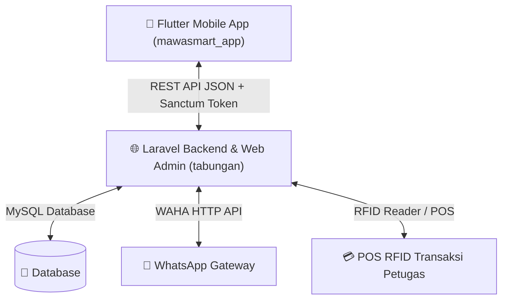

# Product Requirements Document (PRD) & AI Codebase Map

> **Sistem Manajemen Keuangan & Operasional Pesantren Mambaul Hikmah**
> **Versi Dokumen**: 2.0 (As-Built Full System Blueprint)
> **Tanggal Update**: 20 Juli 2026
> **Tujuan**: Dokumen spesifikasi teknis dan peta arsitektur utama agar **pengembang atau AI Agent manapun** dapat langsung memahami seluruh sistem tanpa membaca seluruh baris kode.

---

## 1. Ringkasan Ekosistem

Ekosistem **Mawa Smart** terdiri dari 2 repositori utama yang terintegrasi:



### 1.1 Repositori System Map
1. **Backend & Web Admin** (`/Users/muhaqib/Tabungan ai/tabungan`):
   - **Framework**: Laravel 11, PHP 8.2+, Spatie Permission, Sanctum Auth, Tailwind CSS, Alpine.js, PWA, WAHA WhatsApp Gateway.
   - **Fungsi Utama**: Web admin dashboard, transaksi RFID & PIN santri, manajemen kas utama, laundry, perizinan, kesehatan, kedisiplinan, akademik tarbiyah, broadcast WAHA, dan REST API.
2. **Mobile App Santri** (`/Users/muhaqib/Tabungan ai/mawasmart_app`):
   - **Framework**: Flutter 3.x, Provider Pattern, Dio HTTP, Flutter Secure Storage, Image Picker.
   - **Fungsi Utama**: Client mobile santri untuk cek saldo, transaksi, pengajuan top-up (bukti transfer), hafalan/prestasi, nilai tarbiyah, rekam kesehatan, pelanggaran, perizinan, dan ganti PIN.

---

## 2. Aktor, Role, dan Otorisasi

### 2.1 Role pengguna (`users.role` Enum)
| Role | Deskripsi | Akses Utama |
| :--- | :--- | :--- |
| `admin` | Pengelola Utama / Superadmin Pesantren | Memiliki seluruh akses manajemen sistem, kas, user, WAHA, dan setting |
| `petugas` | Operator Transaksi / Pengurus / Pembimbing | Memproses transaksi kantin/laundry santri, input nilai, perizinan, settlement |
| `santri` | Pemilik Saldo & Data Akademik | Akses mobile app & portal santri (saldo, topup, perizinan, prestasi, dll.) |

### 2.2 Register Permission Spatie (`app/Support/PermissionRegistry.php`)
- **Admin Permissions**:
  - `admin.dashboard.view`, `admin.finance.manage`, `admin.santri.manage`, `admin.petugas.manage`, `admin.kamar.manage`, `admin.tarbiyah.manage`, `admin.laundry.manage`, `admin.blog.manage`, `admin.dashboard-content.manage`, `admin.wa-schedules.manage`, `admin.attendance.dashboard`, `admin.permissions.manage`, `admin.access.manage`, `admin.profile.manage`.
- **Petugas Permissions**:
  - `petugas.dashboard.view`, `petugas.transactions.manage`, `petugas.laundry.manage`, `petugas.laundry.history`, `petugas.finance.dashboard`, `petugas.history.view`, `petugas.withdrawals.manage`.

---

## 3. Skema Database & Model Index (`app/Models/`)

| Model Class | Tabel Database | Fungsi Utama & Relasi |
| :--- | :--- | :--- |
| `User` | `users` | Akun pengawas, petugas, & santri. Memiliki NIS, RFID UID, PIN hash, role, saldo, status active |
| `Transaction` | `transactions` | Transaksi saldo tabungan santri (topup, kantin, koperasi, laundry, kitab, tarik cash) |
| `KasTransaction` | `kas_transactions` | Transaksi arus kas utama pesantren (terpisah dari saldo tabungan santri) |
| `TopUpRequest` | `top_up_requests` | Pengajuan top-up saldo mandiri oleh santri disertai foto bukti transfer |
| `WithdrawalRequest` | `withdrawal_requests` | Pengajuan settlement/tarik tunai kas laci oleh petugas ke admin |
| `LaundrySubscription` | `laundry_subscriptions` | Paket & sisa kuota langganan laundry bulanan santri |
| `LaundryCloth` | `laundry_clothes` | Jenis pakaian santri untuk inventaris laundry |
| `LaundryTransaction` | `laundry_transactions` | Transaksi pencucian laundry (kuota, cash, atau potong tabungan) |
| `FormalClass` | `formal_classes` | Data kelas sekolah formal (misal: 10 IPA, 11 IPS) |
| `PondokClass` | `pondok_classes` | Data kelas pengajian pondok (misal: Ula, Wustho, Ulya) |
| `TarbiyahSubject` | `tarbiyah_subjects` | Mata pelajaran diniyah/tarbiyah |
| `TarbiyahGrade` | `tarbiyah_grades` | Nilai mata pelajaran harian santri |
| `TarbiyahMonthlyExam` | `tarbiyah_monthly_exams` | Data ujian bulanan tarbiyah |
| `TarbiyahMonthlyGrade` | `tarbiyah_monthly_grades` | Nilai ujian bulanan tarbiyah santri |
| `SantriPermission` | `santri_permissions` | Surat izin keluar/pulang santri, status approval, & scan barcode |
| `SantriViolation` | `santri_violations` | Records pelanggaran kedisiplinan santri dan akumulasi poin |
| `SantriHealthRecord` | `santri_health_records` | Rekam medis/kesehatan santri (diagnosa, obat/terapi, status) |
| `PrestasiSantri` | `prestasi_santris` | Pencapaian hafalan kitab/Juz, skor, ustadz pembimbing, & catatan |
| `Kitab` | `kitabs` | Daftar nama kitab/matan yang dihafalkan di pesantren |
| `Attendance` | `attendances` | Log presensi harian santri via scan RFID / manual |
| `Blog` | `blogs` | Artikel berita/pengumuman umum pesantren |
| `DashboardContent` | `dashboard_contents` | Pengumuman internal dashboard petugas/admin |
| `DashboardContentAssignment`| `dashboard_content_assignments`| Assignment pengumuman ke role/user tertentu |
| `WahaMessageLog` | `waha_message_logs` | Log pesan masuk/keluar gateway WhatsApp WAHA |
| `Schedule` | `schedules` | Jadwal pesan pengingat WAHA otomatis/recurring |

---

## 4. Spadiks REST API Contract (`routes/api.php`)

Seluruh endpoint protected memerlukan Header: `Authorization: Bearer <sanctum_token>` dan `Accept: application/json`. Base URL mobile API: `/api/santri/`.

### 4.1 Endpoint Publik
- `GET /api/blog` — List artikel blog publik
- `GET /api/blog/{slug}` — Detail artikel blog
- `GET /api/gallery` — Foto galeri pesantren
- `GET /api/slider` — Banner slider
- `POST /api/registration` — Form pendaftaran santri baru
- `POST /api/contact` — Form hubungi kami
- `POST /api/santri/login` — Auth login santri (`nis`, `pin`). Response: `token`, `user`

### 4.2 Endpoint Protected Santri (`/api/santri/*`)
- `GET /me` — Data profil & saldo terkini santri
- `POST /logout` — Invalidate token Sanctum
- `GET /dashboard` — Ringkasan saldo, pengumuman, transaksi terakhir, & statistik
- `GET /transactions` & `/riwayat` — List riwayat transaksi (Filter: jenis `in`/`out`, bulan, tahun)
- `GET /transactions/chart-data` — Data grafik pengeluaran/pemasukan
- `GET /topups` — List riwayat pengajuan top-up
- `POST /topups` — Pengajuan top-up baru (Multipart Form: `amount`, `bank_name`, `transfer_proof`) *(Middleware: `santri.active`)*
- `GET /topups/pending-count` — Jumlah pengajuan topup status pending
- `GET /profile` — Detail profil santri
- `POST /profile/change-pin` — Ganti PIN 6-digit (`old_pin`, `pin`, `pin_confirmation`) *(Middleware: `santri.active`)*
- `POST /profile/email` — Update email santri
- `GET /prestasi` — List pencapaian hafalan kitab & total poin
- `GET /permissions` & `/perizinan` — List surat perizinan keluar santri
- `GET /security` & `/keamanan` — List catatan pelanggaran & total poin kedisiplinan
- `GET /tarbiyah` — Rekap nilai akademik tarbiyah/diniyah
- `GET /attendance` — Rekap presensi kehadiran santri
- `GET /health` & `/kesehatan` — Rekam medis & riwayat sakit santri

---

## 5. Arsitektur Mobile App Flutter (`mawasmart_app`)

### 5.1 Struktur Kode (`lib/`)
```
lib/
├── config/             # URL API & Konstanta Aplikasi
├── core/
│   └── theme.dart      # Material Design 3 Pesantren Theme System
├── models/             # Data Class/JSON Serializers (User, Transaction, TopUp, Prestasi, dll.)
├── providers/          # State Management (ChangeNotifier)
│   ├── auth_provider.dart
│   ├── dashboard_provider.dart
│   ├── transaction_provider.dart
│   ├── topup_provider.dart
│   ├── prestasi_provider.dart
│   ├── santri_feature_provider.dart
│   └── blog_provider.dart
├── screens/            # UI Screens
│   ├── login_screen.dart
│   ├── home_screen.dart
│   ├── dashboard_screen.dart
│   ├── transaction_history_screen.dart
│   ├── topup_screen.dart
│   ├── prestasi_screen.dart
│   ├── prestasi_detail_screen.dart
│   ├── santri_feature_screen.dart
│   ├── profile_screen.dart
│   ├── blog_list_screen.dart
│   ├── blog_detail_screen.dart
│   └── tutorial_screen.dart
├── services/
│   └── api_service.dart # Client HTTP Dio + FlutterSecureStorage Token Handler
└── widgets/            # Reusable Cards, Badges, & Modal Dialogs
```

### 5.2 Rincian Fitur Utama Layar Flutter
1. **[login_screen.dart](file:///Users/muhaqib/Tabungan%20ai/mawasmart_app/lib/screens/login_screen.dart)**:
   - Form input NIS dan 6-digit PIN.
   - Pengecekan status akun aktif dan auto-save token Sanctum ke `FlutterSecureStorage`.
2. **[dashboard_screen.dart](file:///Users/muhaqib/Tabungan%20ai/mawasmart_app/lib/screens/dashboard_screen.dart)**:
   - **Balance Card**: Tampilan saldo dengan background gradient khas pesantren.
   - **Peringatan Saldo Rendah**: Alert banner jika saldo ≤ Rp 10.000.
   - **Quick Actions**: Navigasi ke Riwayat, Top Up, Prestasi, dan Tanya Ustadz/Fitur.
   - **Recent Transactions**: List 3 transaksi terakhir dengan pull-to-refresh.
3. **[transaction_history_screen.dart](file:///Users/muhaqib/Tabungan%20ai/mawasmart_app/lib/screens/transaction_history_screen.dart)**:
   - Filter transaksi: Semua / Masuk / Keluar, serta filter Bulan & Tahun.
   - Ringkasan total pemasukan & pengeluaran.
   - Icon & warna khusus tiap kategori (Top Up, Kantin, Koperasi, Laundry, Beli Kitab, Tarik Tunai, dll.).
4. **[topup_screen.dart](file:///Users/muhaqib/Tabungan%20ai/mawasmart_app/lib/screens/topup_screen.dart)**:
   - Kartu Info Rekening Bank Pesantren (BSI 712 888 2026).
   - Tombol nominal cepat (10K, 20K, 50K, 100K, 200K, 500K).
   - Image Picker untuk memilih/mengambil foto bukti transfer.
   - List status riwayat top-up (Pending, Approved, Rejected).
5. **[prestasi_screen.dart](file:///Users/muhaqib/Tabungan%20ai/mawasmart_app/lib/screens/prestasi_screen.dart)** & **[prestasi_detail_screen.dart](file:///Users/muhaqib/Tabungan%20ai/mawasmart_app/lib/screens/prestasi_detail_screen.dart)**:
   - Display total poin prestasi santri.
   - List pencapaian hafalan kitab/Juz dengan filter status hafalan.
   - Detail modal/screen: Nilai, ustadz pembimbing, dan catatan khusus.
6. **[santri_feature_screen.dart](file:///Users/muhaqib/Tabungan%20ai/mawasmart_app/lib/screens/santri_feature_screen.dart)**:
   - Pusat fitur lengkap santri berbasis Tab Navigasi:
     - **Tab Perizinan**: Status surat izin keluar & riwayat izin.
     - **Tab Keamanan**: Catatan pelanggaran disiplin & poin pelanggaran.
     - **Tab Tarbiyah**: Rekap nilai ujian & mata pelajaran diniyah.
     - **Tab Presensi**: Rekap kehadiran santri.
     - **Tab Kesehatan**: Rekam kesehatan & riwayat perawatan medis.
7. **[profile_screen.dart](file:///Users/muhaqib/Tabungan%20ai/mawasmart_app/lib/screens/profile_screen.dart)**:
   - Informasi akun (Nama, NIS, Email, Tanggal Bergabung).
   - Fitur Ganti PIN 6-Digit via Modal Dialog secure.
   - Konfirmasi Logout.

### 5.3 Design System & Tokens ([theme.dart](file:///Users/muhaqib/Tabungan%20ai/mawasmart_app/lib/core/theme.dart))
```
Primary Color:      #004d4c (Dark Teal - Khas Pesantren)
Primary Container:  #006766
Primary Fixed:      #a2f0ee (Light Teal)
Secondary:          #5c614d (Olive Green)
Tertiary:           #755b00 (Gold accent)
Success:            #2e7d32
Error:              #ba1a1a
Warning:            #f57c00
```

---

## 6. AI Agent Code Editing Cheat Sheet

Ketika mendapat permintaan perubahan dari pengguna, AI Agent harus langsung merujuk ke tabel berikut tanpa perlu melakukan scanning file secara keseluruhan:

| Tujuan Perubahan / Fitur | File yang Harus Diperiksa / Diubah |
| :--- | :--- |
| **Menambah API Mobile Baru** | 1. Backend: `routes/api.php` & Controller terkait di `app/Http/Controllers/Api/`<br>2. Frontend: [api_service.dart](file:///Users/muhaqib/Tabungan%20ai/mawasmart_app/lib/services/api_service.dart), Provider di `lib/providers/`, dan Screen terkait di `lib/screens/` |
| **Mengubah Skema Data Santri / Wallet** | 1. Backend: `database/migrations/*`, `app/Models/User.php`, `app/Models/Transaction.php`<br>2. Frontend: `lib/models/user_model.dart`, `lib/models/transaction_model.dart` |
| **Mengubah Logika Topup / Verifikasi** | 1. Backend: `app/Http/Controllers/Api/SantriTopUpController.php`, `app/Http/Controllers/Admin/TopUpController.php`<br>2. Frontend: [topup_screen.dart](file:///Users/muhaqib/Tabungan%20ai/mawasmart_app/lib/screens/topup_screen.dart), `lib/providers/topup_provider.dart` |
| **Memodifikasi Fitur Perizinan / Surat Izin** | 1. Backend: `app/Http/Controllers/Api/SantriPermissionController.php`, `app/Models/SantriPermission.php`<br>2. Frontend: [santri_feature_screen.dart](file:///Users/muhaqib/Tabungan%20ai/mawasmart_app/lib/screens/santri_feature_screen.dart), `lib/providers/santri_feature_provider.dart` |
| **Menambah Permission Role Admin/Petugas** | 1. Backend: `app/Support/PermissionRegistry.php` dan seeder database terkait |
| **Mengubah UI Theme / Warna Aplikasi Mobile** | 1. Frontend: [theme.dart](file:///Users/muhaqib/Tabungan%20ai/mawasmart_app/lib/core/theme.dart) |
